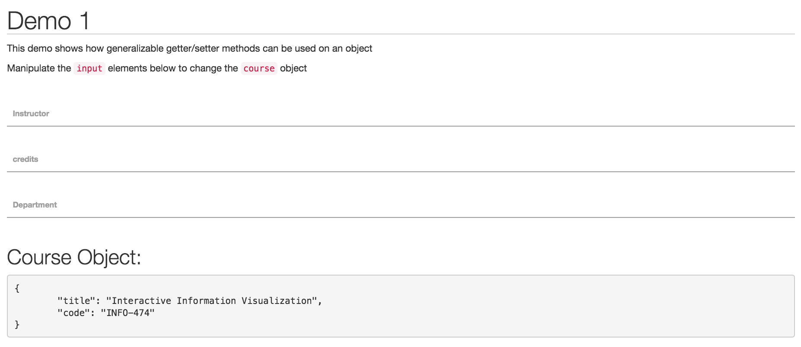

# Demo-1

The purpose of this demo is to show how to implement getter/setter methods on an object in JavaScript. The site is live [here](http://mfviz.com/strata-2016/demo-1/), which looks like this:

