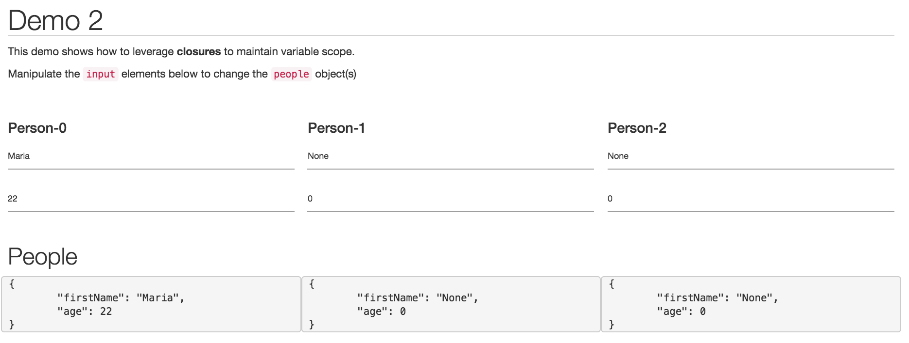

# Demo-2

The purpose of this demo is to show how to leverage **closures** to create multiple elements with the same properties/methods. The site is live [here](http://mfviz.com/strata-2016/demo-2/), which looks like this:

