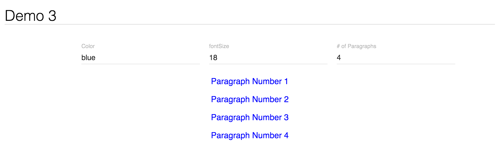

# Demo-3
This demo shows an implementation of the suggested reusability pattern for D3.js. Because this project was bootstrapped with [Create React App](https://github.com/facebookincubator/create-react-app), you'll need to run `npm install` inside the project directory to install necessary packages. Then start your server by running `npm start`.

If you're unfamiliar with React, you can still view the relevant d3.js code in the [TextPlot.js](src/TextPlot.js) file.

The site is live [here](http://mfviz.com/strata-2016/demo-3/), which looks like this:

