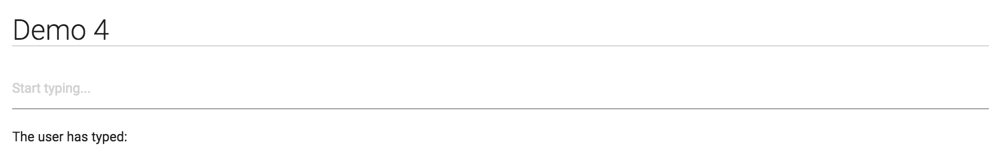

# Demo-4
In this demo, we'll take a look at a simple example of creating a react component, and using a function to update it's state.

The site is live [here](http://mfviz.com/strata-2016/demo-4/), which looks like this:

