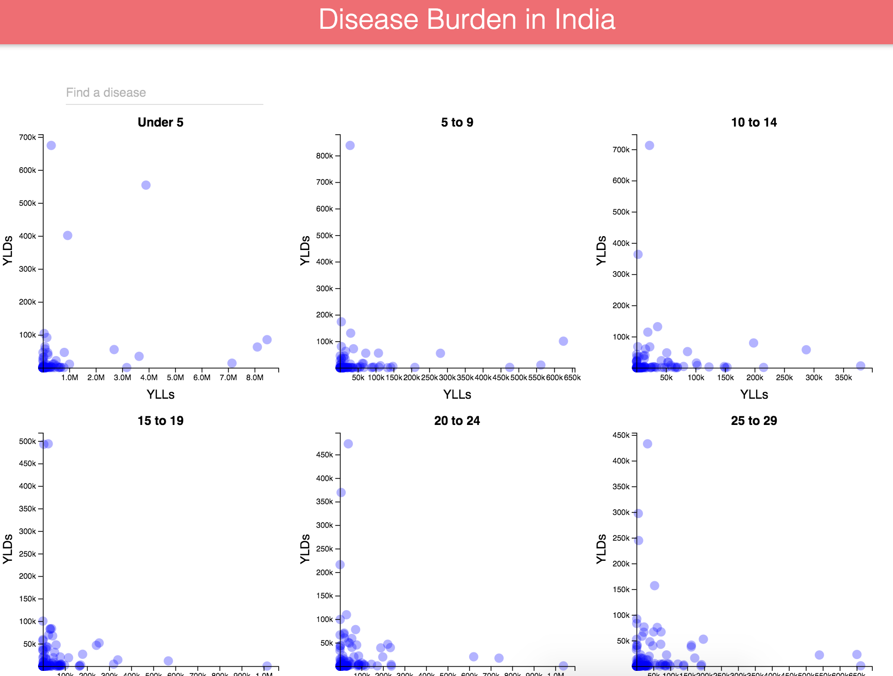

# Demo-6
This exercise demonstrates the use of D3 in conjunction with react. Because this project was bootstrapped with [Create React App](https://github.com/facebookincubator/create-react-app), you'll need to run `npm install` inside the project directory to install necessary packages. Then start your server by running `npm start`.

Disease burden estimates provided here were produced by the [Global Burden of Disease](http://www.healthdata.org/gbd) study, and were downloaded from [here](http://ghdx.healthdata.org/global-burden-disease-study-2013-gbd-2013-data-downloads-full-results).

The site is live [here](http://mfviz.com/strata-2016/demo-6/), which looks like this:

